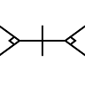

# Per Vices Functional Test System

This test system employs functional tests to verify the operation of Per Vices RX/TX devices.

# Functional Tests

Functional tests are marked qith a "qa" prefix.

Functional tests are automated with internal passing critiera.

Each iteration of an iterative test is tested clean slate with a new connection to the RX/TX device.

# Test System Requirements

The Per Vices Functional Test System is based on the GNURadio Out-Of-Tree-Modules Test system. Ensure
GNURadio for Python2 is installed before continuing.

Additionally, automatic tests within the Per Vies Functional Test System employ
NumPy and SciPy for internal self verification. Ensure NumPy and SciPy for Python2 is installed before continuing.

Finally, this test system requires the Per Vices UHD driver to be installed (see the Per Vices GitHub page).

Ensure one BNC cable per channel is looped from its TX to RX channel. Ensure an attenuator is fixed to
each RX line as driving a TX line with max gain will damage the RX line at max gain.

# Test System Layout

The Per Vices Functional Test System relies on TX/RX channel loop-backs for signal transmitting, receiving,
processing, and verification. The test system, from a high level, transmits a signal from a TX channel to
a corresponding RX channel using GNURadio. Data packet signal integrity is verified with the
SciPy library. Once all tests pass the RX/TX device is marked as functional.

# Directory Layout

The Per Vices Functional Test System is built from GNURadio's Out of Tree Module generator.
Currently no blocks are exported via XML to the GNURadio Companion; this out of tree module
serves as a foundation for internal verification of Per Vices products.

# Install

CMake is required for building the Per Vices Functional Test System.
Clone the repo, cd /to/the/folder, build, and run all the functional tests:

```
git clone https://github.com/glouw/gr-pv

cd gr-pv

mkdir build

cd build

cmake ..

mv ../qa_crimson_burst_dummy.py python/

make test
```

In total testing will take approximately 10 hours.

Once all functional tests pass the RX/TX device is ready for use.
